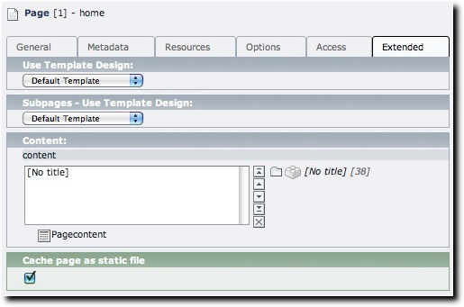

Page configuration
^^^^^^^^^^^^^^^^^^

.. :align: left

By default all pages are marked to be cached. The same logic TYPO3 follows to create page cache is used to create static pages. So you should not have to touch the checkbox in the page properties.

If you want to make it very explicit that you don't want a page to be cached, uncheck the 'Cache page as static file' checkbox in the page properties of that page. You want to do this if your page uses 'timing' features or typoscript conditions that to not work properly when caching to static files.

|pagesettings|