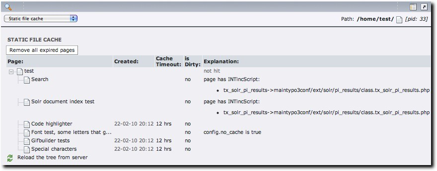

Monitoring
----------

.. :align: left

The state of the indexing table can be monitored using the 'web' -> 'info' module. Choose 'Static file cache' from the dropdown list.

A browsable tree will appear which you can use to monitor the state of the indexing process. It will tell you if a file has been cached statically, if so when it was cached and when it is set to expire. If you have any other ideas, let me know.

But most importantly, when a file has been hit but has not been cached, the explanation column will explain why. This can be very useful when you are trying to optimize your site. You might find out that a whole tree has been set to no_cache for example.

|monitoring|