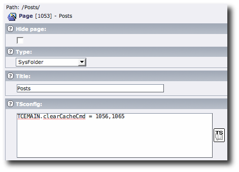

Static tt_news setup
--------------------

.. :align: left

Normally tt_news is a USER_INT plugin. You can set it to USER using TypoScript:

.. code-block:: bash

   plugin.tt_news = USER

Now you need to manually clear the pages on which you have the tt_news plugin installed. Luckily for you this can be accomplished easily using:

.. code-block:: bash

   TCEMAIN.clearCacheCmd = pid,pid,pid

Where pid is the pid of the pages on which you have the news plugin installed. You place this snippet as TSconfig on your news folder.

|news|

Now, if you create a new news item in the news folder, the cache for the given pid's will automatically be cleared. This means of couse that the static files will also be cleared.

There are more TSconfig settings you might want to look into:

*clearCacheCmd / List of values (integers, "all", "pages")*

This can allow you to have the cache for additional pages cleared when saving to some page or branch of the page tree.
Examples:
# Will clear the cache for page ID 12 and 23
# when saving a record in this page:
TCEMAIN.clearCacheCmd = 12,23

# Will clear all pages cache:
TCEMAIN.clearCacheCmd = pages

# Will clear ALL cache:
TCEMAIN.clearCacheCmd = all

*clearCache_pageSiblingChildren / boolean*

If set, then children of all siblings of a page being edited will have the page cache cleared.
(Default is that when a page record is edited, the cache for itself and siblings (same level) is cleared.)

*clearCache_pageGrandParent / boolean*

If set, then the grand parent of a page being edited will have the page cache cleared.